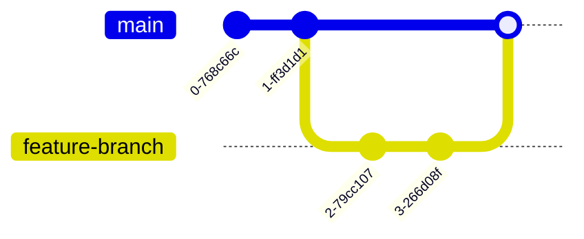

# ardeeno-backend
Fast deployment with heroku at [api.ardeeno.cloud](api.ardeeno.cloud). Docs are available at [api.ardeeno.cloud/api-docs](api.ardeeno.cloud/api-docs).

Following [swagger 2.0](https://swagger.io/specification/v2/) API standard.

## WorkFlow
- `main(production)` Branch: Only tested code
- `feature-branch`: Used to work on a feature from the [KanBan Board](https://github.com/orgs/T41-SE22/projects/1/views/1)
- `patch-branch`: Used to patch a feature

From `main` branch create a new `feature-branch`. Work on development, documentation and testing. Push your new branch upstream and open a pull request on `main` branch.

### Visualized
