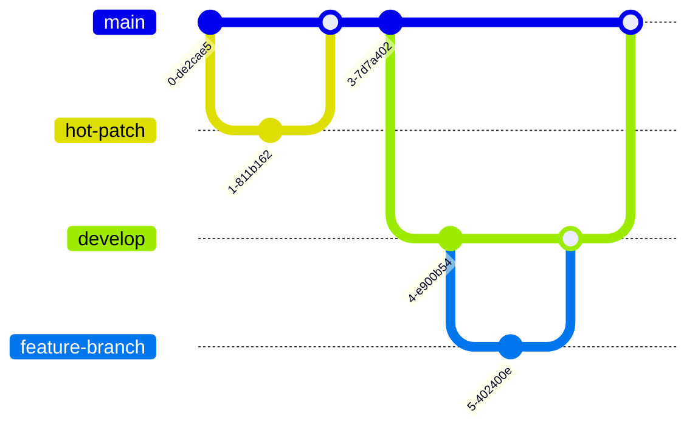

# ardeeno-backend
Fast deployment with heroku at [api.ardeeno.cloud](http://api.ardeeno.cloud). Docs are available at [api.ardeeno.cloud/api-docs](http://api.ardeeno.cloud/api-docs).

Following [Open Api 3.0](https://swagger.io/specification/) API standard.

## WorkFlow
- `main(production)` branch: Only fully-tested production-level code to be deployed
- `develop` branch: Used to work on a new release
- `feature` branch: Used to work on a feature from the [KanBan Board](https://github.com/orgs/T41-SE22/projects/1/views/1)
- `patch` branch: Used to patch a feature
- `hot-patch` branch: Used to patch a feature directly on `main`

From `develop` branch create a new `feature` branch. Work on development, documentation and testing. Push your new branch upstream and open a pull request on `develop` branch. Jest testing is automated on any pull requests to `develop` and `main`.

Deployment to Heroku is automated on any push (and merge) to `main`.

### Visualized


## Usage

### .env
```bash
DB_HOST=
DB_USER=
DB_PASS=
PORT=
MONGODB_URI=
SUPER_SECRET=
```